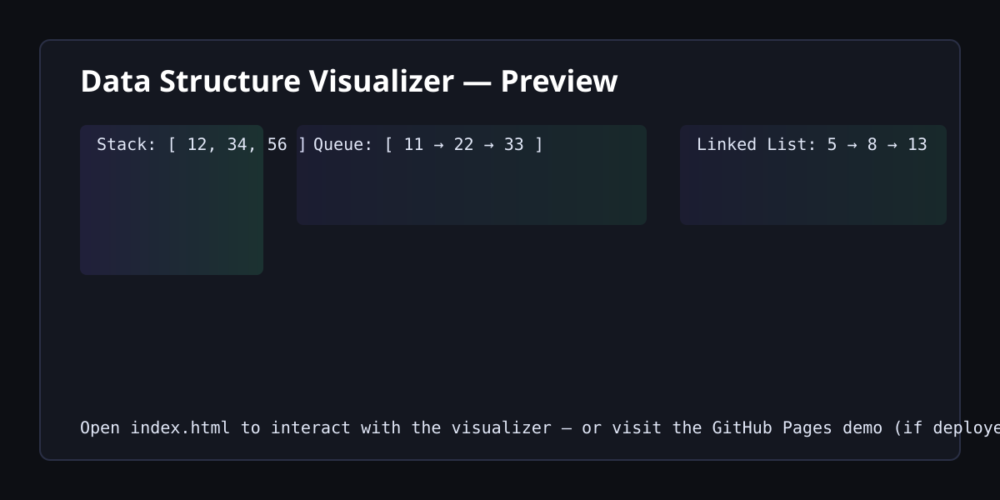

# Data Structure Visualizer



A small interactive visualizer for basic data structures: Stack, Queue, and Singly Linked List.

## Features
- Visualize and perform operations on:
  - Stack: `push`, `pop`, `peek`
  - Queue: `enqueue`, `dequeue`, `front`
  - Linked List: `insert at head`, `insert at tail`, `delete`, `search`
- Lightweight single-page app using plain HTML/CSS/JS.
- Friendly UI with animations and explanatory panels.

## Run locally
Open `index.html` directly in a browser (double-click) or serve over a simple HTTP server for best results (recommended):

Using Python 3:

```bash
python -m http.server 8000
# then visit http://localhost:8000
```

Or use a VS Code Live Server extension.

## Files
- `index.html` — UI and structure
- `style.css` — styles
- `script.js` — application logic

## Deploy to GitHub Pages
This repo includes a GitHub Actions workflow that deploys the repository root to GitHub Pages on push to the default branch.

1. Create a repository on GitHub and push this project.
2. The workflow `.github/workflows/pages.yml` will run on pushes and publish the site.

## Notes
- No build step required — this is a static site.
- If you want a custom domain, add a `CNAME` file in the repo root.

## License
This project is available under the MIT License (see `LICENSE`).
